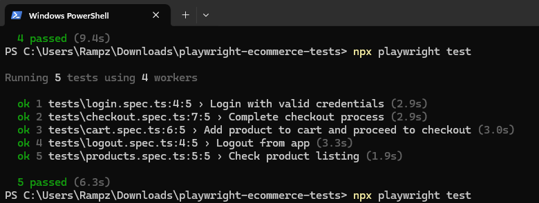

# QA Automation Portfolio - SauceDemo - Playwright

</img>

This project is a complete automation test suite using **Playwright** and **TypeScript**, targeting the [SauceDemo](https://www.saucedemo.com) e-commerce demo site.

## 🧪 Tech Stack
- Automation Tool: **Playwright**
- Language: **TypeScript**
- Framework: **Dotenv**

## 📁 Structure
```
playwright-ecommerce-tests/
├── tests/                # Test specifications
├── pages/                # Page Object Models
├── .env                  # Environment variables (username & password)
├── playwright.config.ts  # Playwright configuration
├── tsconfig.json         # TypeScript configuration
├── package.json          # Dependencies & scripts
└── README.md             # Project documentation
```

## ✅ What is tested?
| Area        | Scenarios |
|-------------|-----------|
| **Login**   | Valid & invalid login attempts |
| **Inventory** | Product listing visibility |
| **Cart**    | Add and remove items from cart |
| **Checkout**| Enter user info and complete checkout |
| **Finish**  | Confirmation message validation |

## 🚀 How to Run
```bash
git clone https://github.com/your-username/playwright-ecommerce-tests.git
cd playwright-ecommerce-tests
npm install
```

Create a `.env` file:
```
USERNAME=standard_user
PASSWORD=secret_sauce
```

Run the tests:
```bash
npx playwright test
```

> Make sure Chrome is installed and in your system path.---

Feel free to fork or contribute. QA is love, QA is life. 💙
